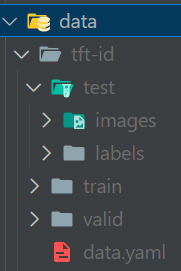

# Custom Dataset
If you have a custom dataset, the structure has to be the same as in the roboflow datasets. You have to create a folder with your dataset inside in ./data/"your_folder_name". "your_folder_name" has to be added in ./config/config.yaml under "project_name" and "Roboflow:" has to be set to 1.

### Dataset structure

